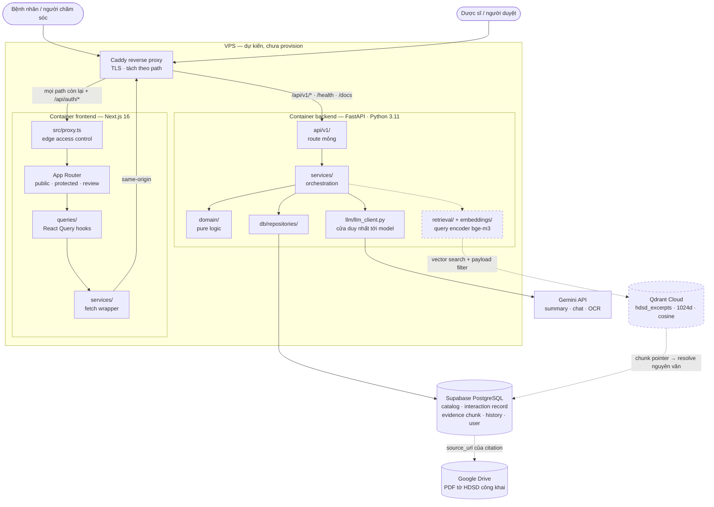
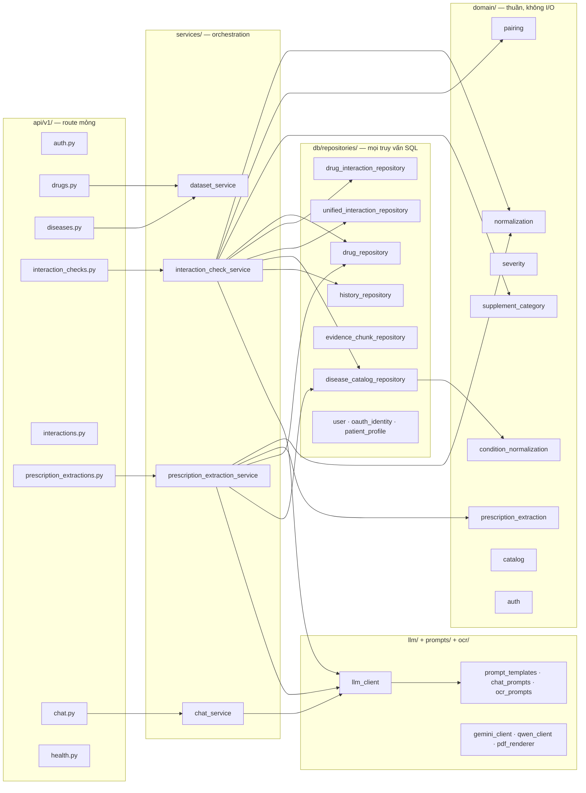
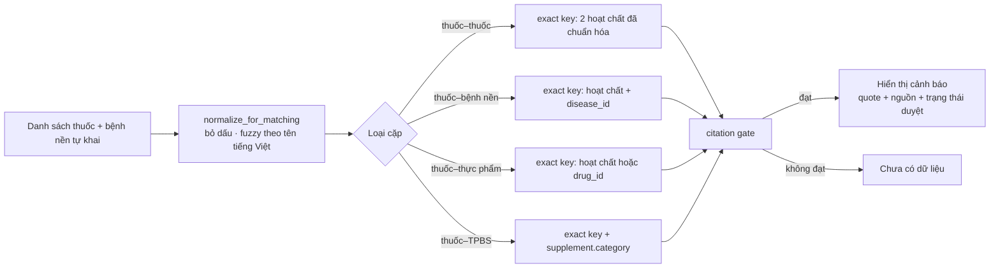
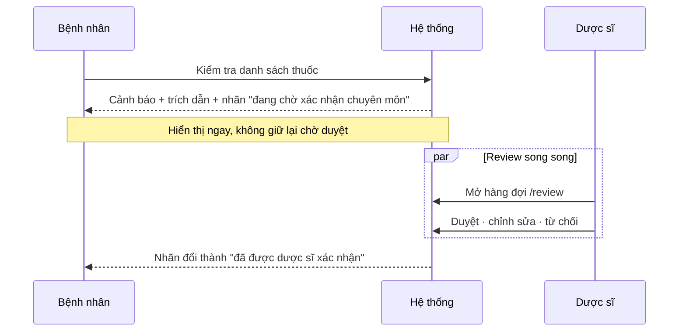
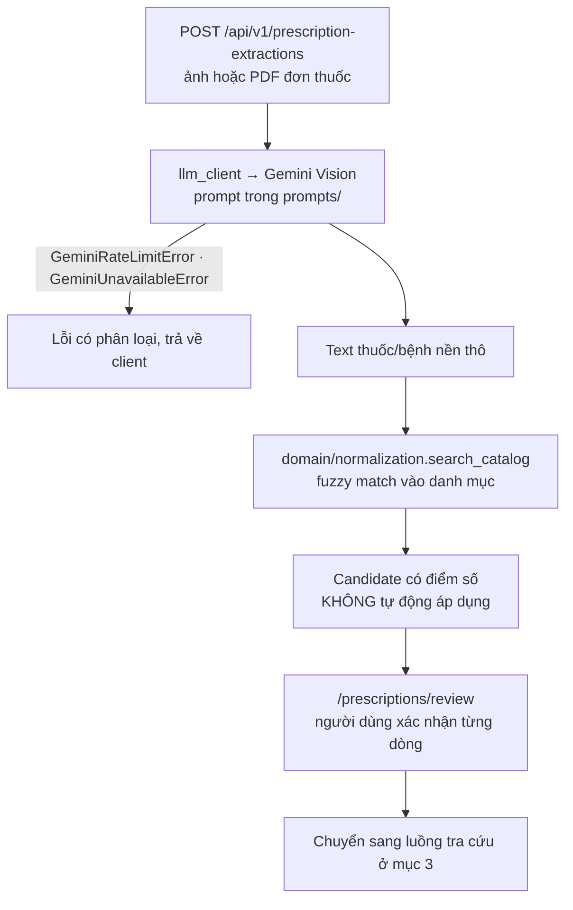
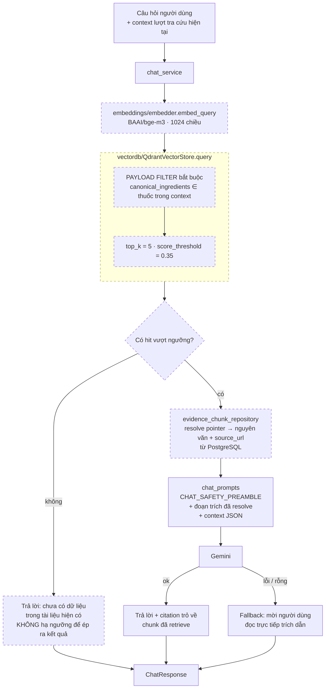
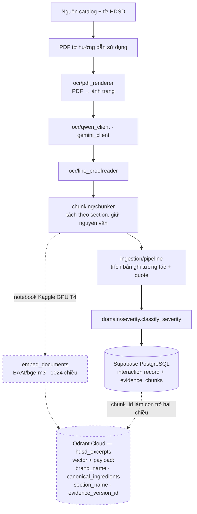

# Kiến trúc hệ thống

Đây là deliverable #3 và phải được cập nhật khi kiến trúc thay đổi. Lý do ra quyết định
nằm trong [`adrs/`](../adrs/); file này mô tả hệ thống **hiện đang được cài đặt** như thế
nào. Phần [Khoảng cách giữa thiết kế và cài đặt](#khoảng-cách-giữa-thiết-kế-và-cài-đặt) ghi
rõ những chỗ code chưa khớp với spec — không tô hồng để lấy điểm.

## 1. Tổng quan hệ thống

> **Quy ước đọc sơ đồ trong tài liệu này:** nét liền = đã cài đặt và đang chạy; **nét đứt =
> kiến trúc mục tiêu, chưa nối vào code**. Mọi thành phần nét đứt đều có interface đã định
> nghĩa sẵn trong repo nhưng thân hàm còn `NotImplementedError`.

Trình duyệt chỉ thấy **một origin duy nhất**, nên không có preflight CORS và Google OAuth
chỉ khai một authorized origin. Chi tiết cấu hình proxy: [`docs/deployment.md`](deployment.md).

**Supabase PostgreSQL là source of truth duy nhất trên request path.** Mọi bản ghi tương
tác, mọi đoạn trích nguyên văn và mọi trạng thái duyệt đều nằm ở đây.

## 2. Bản đồ thành phần backend

Quy tắc phân tầng được giữ đúng trong code: route không chứa SQL, `domain/` không import
framework hay I/O, và mọi lời gọi model đều đi qua `llm/llm_client.py`.

## 3. Luồng chính — tra cứu tương tác

Đây là luồng nghiệp vụ trung tâm, cài đặt tại
[`interaction_check_service.py`](../backend/src/medsafe/services/interaction_check_service.py).

```mermaid
flowchart TB
    In["POST /api/v1/interaction-checks<br/>drug_ids + disease_ids"] --> Val

    Val["Validate danh mục<br/>drug/disease còn hiệu lực?"] -->|"không"| Err["400 — bản ghi ngoài danh mục"]
    Val -->|"có"| Expand

    Expand["domain/normalization + domain/pairing<br/>brand name → canonical ingredient<br/>N thuốc → C&#40;N,2&#41; cặp hoạt chất"] --> Lookup

    subgraph Lookup["4 truy vấn EXACT-KEY, batch, tuần tự trên 1 transaction"]
        Q1["drug_interaction_repository<br/>find_by_pairs — thuốc–thuốc"]
        Q2["unified_interaction_repository<br/>find_disease_interactions — thuốc–bệnh nền"]
        Q3["unified_interaction_repository<br/>find_food_notes — thuốc–thực phẩm"]
        Q4["unified_interaction_repository<br/>find_supplement_notes — thuốc–TPBS"]
    end

    Lookup --> Ev["list_candidate_evidence<br/>nạp evidence chunk của các thuốc liên quan"]
    Ev --> Gate

    Gate{{"CITATION GATE — _citation&#40;&#41;<br/>quote không rỗng?<br/>quote nằm trong evidence chunk?<br/>source_url hiển thị được?"}}

    Gate -->|"đạt"| Items["items + notes<br/>kèm quote · source · section · review_status"]
    Gate -->|"không đạt"| Unavail["unavailable[]<br/>reason: missing-record | missing-citation"]

    Items --> Sum["_summarize — Gemini structured output<br/>diễn giải lại field đã có của bản ghi"]
    Sum -->|"trả đủ & đúng recordId"| Gen["aiSummary.status = generated"]
    Sum -->|"lỗi / thiếu / sai id"| Fb["aiSummary.status = fallback<br/>dùng nguyên văn consequence · management"]

    Gen --> Resp
    Fb --> Resp
    Unavail --> Resp

    Resp["InteractionCheckResponse<br/>items · notes · unavailable<br/>severity_scale · highlight_id"] --> Hist
    Hist["history_repository.save<br/>snapshot toàn bộ lượt tra cứu"] -->|"lỗi → rollback"| Out
    Hist -->|"ok → check_id"| Out
    Out["200 — trả về client"]
```

### Vì sao citation gate nằm trước LLM

Đây là chỗ nguyên tắc **“không bịa cảnh báo”** được thực thi bằng cấu trúc code, không phải
bằng lời dặn trong prompt:

| Bước | Ai quyết định | Ghi chú |
|---|---|---|
| Có tương tác hay không | Truy vấn exact-key trong PostgreSQL | Model không tham gia |
| Mức độ nghiêm trọng | Cột `severity` của bản ghi | Model không tham gia |
| Trích dẫn nguyên văn | `_citation()` đối chiếu quote với evidence chunk | Bản ghi không khớp bị loại |
| Diễn giải cho người đọc | Gemini, structured output | Chỉ được viết lại field đã có |

Một bản ghi không dựng được citation hợp lệ sẽ **không bao giờ tới tay LLM** — nó rơi thẳng
vào `unavailable` với `reason = missing-citation`. Khi LLM lỗi, timeout, hoặc trả về thiếu
`recordId`, toàn bộ batch bị bỏ và hệ thống hiển thị nguyên văn field gốc
(`status = fallback`). Nghĩa là **mất LLM thì mất phần diễn giải, không mất tính đúng đắn
của cảnh báo**.

### Bốn loại tra cứu

Cả bốn đường đều là **exact-key lookup**, không đường nào dùng similarity search để kết
luận cặp có tồn tại — vector search chỉ xuất hiện ở luồng hỏi đáp chat tại
[mục 6](#6-luồng-chatbot-có-rag-dẫn-nguồn), nơi nó trả lời câu hỏi mở chứ không sinh cảnh
báo. Lý do ở [ADR 0012](../adrs/0012-reviewed-leaflet-interaction-records.md):
truy vấn “Warfarin + Tamoxifen” mà similarity trả về bản ghi “Acenocoumarol + Tamoxifen” thì
nguồn và trích dẫn đều thật nhưng **sai cặp thuốc**.

Thuốc–thực phẩm và thuốc–TPBS được gộp và khử trùng lặp trước khi trả về: cùng một cặp
hoạt chất–đối tượng có thể xuất hiện ở cả bảng `drug_supplement_interactions` (nguồn chính,
có `category`) lẫn `drug_food_interactions` (nguồn legacy). Service lấy nguồn chính làm gốc,
ghép bổ sung nội dung còn thiếu, gộp citation trùng, và lấy severity nghiêm trọng nhất.

## 4. Duyệt chuyên môn không chặn hiển thị

Trong code, `review_status` chỉ có hai giá trị hiển thị: `pending` và `approved`
— bản ghi `rejected` bị loại ngay ở tầng repository, không bao giờ ra tới response. Với
note gộp từ nhiều nguồn, trạng thái chỉ là `approved` khi **mọi** nguồn thành phần đã được
duyệt. Xem [ADR 0005](../adrs/0005-human-in-the-loop-non-blocking.md).

## 5. Luồng OCR đơn thuốc

OCR chỉ sinh **candidate chưa tin cậy**. Hệ thống không tự chốt thuốc nào đang được dùng;
người dùng phải xác nhận trước khi candidate trở thành input tra cứu.

## 6. Luồng chatbot có RAG dẫn nguồn

Đây là nơi **duy nhất** vector search được dùng trên request path. Nó trả lời câu hỏi mở về
thuốc, không quyết định cặp tương tác nào tồn tại.

Nét đứt là phần sẽ bổ sung; hôm nay `chat_service` đi thẳng từ context sang Gemini không
qua retrieval.

### Ba ràng buộc giữ chatbot không bịa

**1. Payload filter là ranh giới an toàn, không phải tối ưu hoá.** Truy vấn Qdrant luôn kèm
filter theo hoạt chất/biệt dược của đúng các thuốc trong ngữ cảnh người dùng. Không có
filter thì chunk của thuốc khác lọt vào câu trả lời — đúng lỗi “có nguồn thật, sai thuốc”
mà [ADR 0012](../adrs/0012-reviewed-leaflet-interaction-records.md) cảnh báo, chỉ khác là
xảy ra ở tầng hội thoại.

**2. Qdrant giữ vector và con trỏ; PostgreSQL giữ chữ.** Đoạn hiển thị cho người dùng luôn
được resolve ngược về `evidence_chunks` trong PostgreSQL trước khi vào prompt, theo
[ADR 0013](../adrs/0013-cloud-data-and-model-topology.md). Model không bao giờ được đọc
payload của Qdrant làm nguồn hiển thị.

**3. Rỗng là câu trả lời hợp lệ.** Không có hit nào vượt `score_threshold` thì chatbot nói
“chưa có dữ liệu trong tài liệu hiện có”, không suy luận bù. Ngưỡng không được hạ để ép ra
kết quả.

Chatbot vẫn **không có bộ nhớ dài hạn**: retrieval chạy lại từ đầu mỗi request, không có
trạng thái nào được agent tự ghi nhớ giữa các phiên.

## 7. Ingestion — chạy offline, không nằm trên request path

`ingestion/` là batch job chạy qua `ingestion/cli.py`, không bao giờ được gọi từ route.
Việc sinh embedding chạy trên Kaggle GPU T4 nên **không tốn tài nguyên VPS** và không nằm
trên request path.

Điểm phải giữ đúng khi implement: cùng một `chunk_id` tồn tại ở cả hai nơi. PostgreSQL giữ
nội dung nguyên văn để hiển thị, Qdrant giữ vector cùng payload để lọc. Nếu hai bên lệch
phiên bản, citation sẽ trỏ sai đoạn — nên `evidence_version_id` là payload bắt buộc, đã khai
trong [`backend/config.yaml`](../backend/config.yaml).

## 8. Thành phần và trách nhiệm

| Thành phần | Công nghệ | Trách nhiệm |
|---|---|---|
| Reverse proxy | Caddy | TLS tự động, tách `/api/v1/*` cho backend, phần còn lại cho Next.js |
| Frontend | Next.js 16 · React 19 · Tailwind v4 · shadcn/ui | UI, ba nhóm route `public` / `protected` / `review` |
| Edge access control | `frontend/src/proxy.ts` | Chặn route trước khi render, không để lộ trang cần quyền |
| API client | `queries/` + `services/` + `lib/api/types.gen.ts` | Component không gọi service trực tiếp; type sinh từ OpenAPI |
| Backend API | FastAPI · Python 3.11 | Validate input, gọi service, serialize schema |
| Orchestration | `backend/src/medsafe/services/` | Điều phối nhiều repository + LLM cho một use case |
| Pure domain | `backend/src/medsafe/domain/` | Normalize, pairing, severity, phân loại TPBS — không import framework |
| Data access | `db/repositories/` | Toàn bộ SQL; batch theo key để tránh N+1 |
| Model access | `llm/llm_client.py` | Cửa duy nhất tới Gemini; phân loại rate-limit / unavailable |
| Prompt | `prompts/` | Toàn bộ prompt tập trung, không viết inline |
| Prescription OCR | `ocr/gemini_client` | Sinh candidate chưa tin cậy từ ảnh đơn thuốc |
| Leaflet OCR | `ocr/qwen_client` + `pdf_renderer` | Batch extraction tờ HDSD, chạy offline |
| Relational store | Supabase PostgreSQL | Catalog, bản ghi tương tác, evidence chunk, review state, history |
| History snapshot | `db/models/interaction_history` | Lưu nguyên trạng input, kết quả, AI summary và cả `unavailable` |
| Embedding | `embeddings/embedder.py` · BAAI/bge-m3 | Sinh vector 1024 chiều; `embed_documents` chạy offline trên Kaggle, `embed_query` chạy trên request path của chat |
| Vector store | `vectordb/vector_store.py` · Qdrant Cloud | Index ngữ nghĩa tờ HDSD, lọc theo payload để cách ly thuốc |
| Retrieval | `retrieval/retriever.py` | Lọc theo `score_threshold`, trả rỗng thay vì đoán |
| Ingestion | `ingestion/` | Batch job qua CLI |

## 9. Khoảng cách giữa thiết kế và cài đặt

Ghi lại trung thực để phần System Design được chấm trên hiện trạng thật.

| Hạng mục | Trạng thái | Chi tiết |
|---|---|---|
| Tra cứu 4 loại tương tác + citation gate | ✅ Đang chạy | Exact-key lookup, citation gate, fallback khi LLM lỗi |
| OCR đơn thuốc · chat · history · auth | ✅ Đang chạy | — |
| `embeddings/embedder.py` | ⏳ Interface xong, thân hàm rỗng | `embed_documents` / `embed_query` còn `NotImplementedError` |
| `vectordb/vector_store.py` | ⏳ Interface xong, thân hàm rỗng | `QdrantVectorStore.upsert/query/delete_by_drug` còn `NotImplementedError` |
| `retrieval/retriever.py` | ⏳ Interface xong, thân hàm rỗng | Cả 4 method còn `NotImplementedError` |
| Chat đọc Qdrant để dẫn nguồn | ⏳ Kế hoạch | `chat_service` hiện đi thẳng context → Gemini, chưa qua retrieval |
| LangGraph workflow | ❌ Không dùng | `agents/`, `agents/nodes/`, `agents/tools/` rỗng hoàn toàn; `langgraph` nằm trong dependency nhưng không import ở đâu. Orchestration thật ở `services/` |
| Retrieval cho thuốc–thực phẩm | ❌ Khác spec | `AGENTS.md` mô tả semantic search; code dùng exact-key SQL như ba loại còn lại |
| Deploy | ❌ Chưa có | VPS chưa provision; local chạy `docker compose up` |

### Hai việc phải chốt trước khi implement RAG

**1. Thống nhất model embedding — hiện đang mâu thuẫn.**
[`backend/config.yaml`](../backend/config.yaml) khai `provider: openai`,
`model: text-embedding-3-small`, `dimensions: 1536`. Kế hoạch và
[`docs/kaggle_embedding_guide.md`](kaggle_embedding_guide.md) dùng `BAAI/bge-m3`,
**1024 chiều**. Hai con số này không thể cùng đúng: vector câu hỏi phải sinh từ **đúng model
đã sinh vector tài liệu**, nếu không thì khác chiều sẽ bị Qdrant từ chối, mà trùng chiều thì
điểm similarity vô nghĩa. Chọn bge-m3 thì phải sửa `config.yaml` xuống 1024 trước khi
upsert bất kỳ vector nào.

**2. Quyết định nơi chạy `embed_query` trên request path.**
Sinh vector tài liệu chạy offline trên Kaggle GPU T4 là hợp lý. Nhưng mỗi câu hỏi chat cũng
cần được vector hoá **lúc chạy**, và Kaggle không phục vụ được việc đó.

| Phương án | Ưu | Nhược |
|---|---|---|
| Nạp bge-m3 trong container backend | Không phụ thuộc bên thứ ba, không tốn thêm chi phí | Image nặng thêm ~2 GB, RAM cao, inference CPU chậm — VPS nhỏ khó chịu nổi |
| Gọi inference endpoint có sẵn cho bge-m3 | Container gọn, độ trễ ổn định | Thêm một nhà cung cấp, thêm secret, thêm điểm hỏng |
| Dùng model embedding dạng API cho **cả hai** phía | Đơn giản nhất về vận hành | Bỏ lợi thế tiếng Việt chuyên ngành của bge-m3, tốn phí theo lượt |

Phương án 2 hợp với hiện trạng nhất: giữ được bge-m3 cho tiếng Việt y dược mà không phình
container trên VPS chưa provision. Cần leader chốt và ghi ADR vì đây là quyết định khó đảo
ngược — đổi model embedding sau khi đã upsert nghĩa là phải embed lại toàn bộ corpus.

Ngoài ra cần cập nhật `AGENTS.md` và `specs/app-flow.md`: ranh giới RAG thật của hệ thống là
**vector search phục vụ hỏi đáp chat**, còn cả bốn loại tương tác đều dùng exact-key lookup.
Bảng ranh giới hiện tại trong `AGENTS.md` đang mô tả thuốc–thực phẩm dùng semantic search,
không khớp code.

## 10. Triển khai và CI

Local: `docker compose up` với PostgreSQL 16, backend uv multi-stage non-root, Next.js
standalone non-root. Test `domain/` và adapter chạy được mà không cần cloud credential.

CI ([`.github/workflows/ci.yml`](../.github/workflows/ci.yml), self-hosted runner):

| Job | Bước |
|---|---|
| Backend | `uv sync` → `ruff check` → `ruff format --check` → `pytest` |
| Frontend | `yarn install` → `yarn lint` → `yarn build` |

Biến `NEXT_PUBLIC_*` được nhúng vào bundle tại **build time**, nên Docker Compose phải
truyền qua `build.args`, không phải `environment` lúc chạy.

Production host, migration/rollback và observability chỉ được chốt sau khi leader duyệt
deployment ADR; theo dõi trong Jira project `VMEC`.
