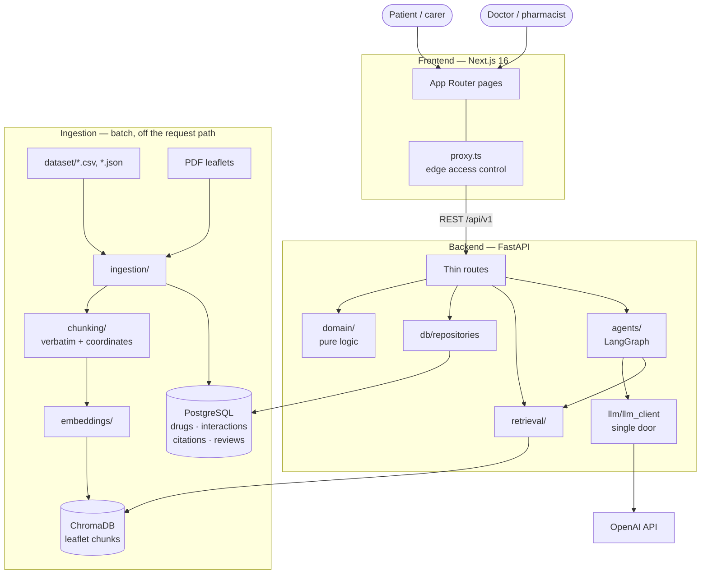
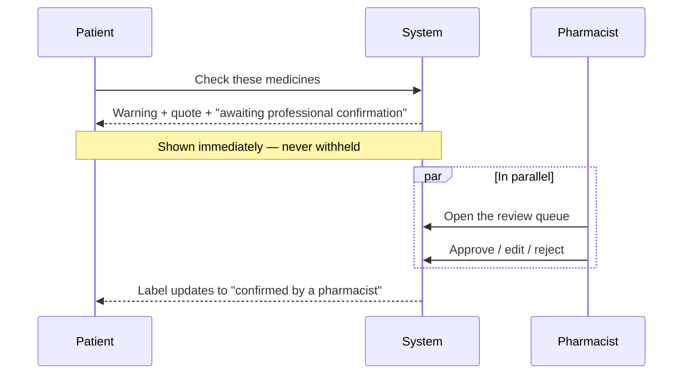

# Architecture

Deliverable #3. Update this whenever the architecture changes.

Design rationale lives in [`adrs/`](../adrs/); this file shows *what* the system looks
like, not *why* it was chosen that way.

---

## System overview

## The two lookup paths ★

The single most important thing to understand: **drug–drug and drug–food resolve
differently**, and mixing them up produces warnings that cite a real source but name the
wrong pair of drugs.

```mermaid
graph TB
    Q[Medicine list from the user] --> Norm[domain/normalization<br/>fuzzy match to ingredient]
    Norm --> Pair[domain/pairing<br/>N drugs → C&#40;N,2&#41; pairs]

    Pair --> Kind{Interaction type}

    Kind -->|drug–drug| Table[db/repositories<br/>EXACT-KEY LOOKUP]
    Kind -->|drug–food| Vector[retrieval/<br/>semantic search]

    Table --> Found{Record found?}
    Vector --> Score{Above score_threshold?}

    Found -->|yes| Sev[domain/severity<br/>deterministic]
    Found -->|no| NoData[notFound → 'no data available']
    Score -->|yes| Sev
    Score -->|no| NoData

    Sev --> Cite{Has a verbatim citation?}
    Cite -->|yes| Show[Show the warning<br/>+ quote + source + review status]
    Cite -->|no| Drop[Do not render]
```

Never use vector search to decide whether a **drug–drug** interaction exists — see
[ADR 0004](../adrs/0004-drug-drug-lookup-not-similarity.md).

## Review flow — non-blocking

A `pending` warning is displayed in full. There is deliberately no gate holding warnings
back until approval — see [ADR 0005](../adrs/0005-human-in-the-loop-non-blocking.md).

## Components

| Component | Technology | Purpose |
|---|---|---|
| Frontend | Next.js 16, React 19, Tailwind v4 | UI, three access tiers |
| Edge access control | `frontend/src/proxy.ts` | Blocks routes before render |
| Backend API | FastAPI, Python 3.11 | Thin routes: validate → domain/repository → schema |
| Pure logic | `backend/src/medsafe/domain/` | Normalisation, pairing, severity. No framework imports |
| Agent | LangGraph | Orchestrates multi-step lookups |
| LLM access | `llm/llm_client.py` | The single door to the model |
| Relational store | PostgreSQL 16 (SQLite in dev) | Drugs, interactions, citations, reviews |
| Vector store | ChromaDB | Leaflet chunks for retrieval |
| Ingestion | `ingestion/` | Batch job; never on the request path |

## Deployment

`docker compose up` builds three services: `db` (Postgres 16), `backend` (uv, multi-stage,
non-root) and `frontend` (Next standalone output, non-root). All three expose health
checks.

`NEXT_PUBLIC_*` variables are baked into the frontend bundle at **build** time, so they are
passed as compose `build.args`, not runtime `environment`.

## Known gaps

The backend currently exposes only `/health` and `/api/v1/status`. The business routers in
`api/routes.py` are stubbed out, so the paths above describe the agreed design rather than
running code. Progress: [`planning/backlog.md`](../planning/backlog.md).
