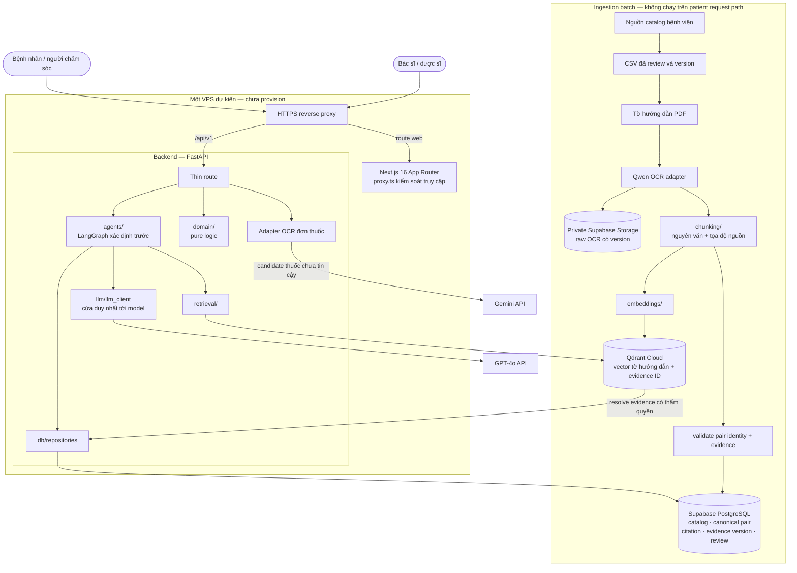
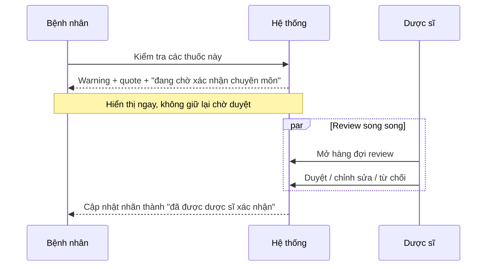

# Kiến trúc hệ thống

Đây là deliverable #3 và phải được cập nhật khi kiến trúc thay đổi. Lý do ra quyết định
nằm trong [`adrs/`](../adrs/); file này mô tả hệ thống hiện được thiết kế như thế nào.

## Tổng quan

Supabase PostgreSQL là relational source of truth cho production. Qdrant chỉ là semantic
index; nó không sở hữu pair, citation hoặc review state. Backend không gọi website người
dùng Qwen; adapter dùng endpoint Alibaba Cloud Model Studio được cấu hình. OCR đơn thuốc
dùng adapter Gemini riêng. URL/model ID ở config, secret nằm ngoài Git.

LangGraph chạy workflow đã định nghĩa và gọi typed repository/retrieval adapter; model
không tạo SQL hoặc tự chọn truth source. GPT-4o chỉ được dùng trong boundary trích xuất có
schema hoặc trình bày bám nguồn, không quyết định interaction existence hay severity.

## Hai đường lookup bắt buộc tách biệt

```mermaid
flowchart TB
    Q[Danh sách thuốc người dùng] --> Norm[domain/normalization<br/>match vào hoạt chất]
    Norm --> Pair[domain/pairing<br/>N thuốc → C&#40;N,2&#41; cặp]
    Pair --> Kind{Loại tương tác}

    Kind -->|thuốc–thuốc| Table[db/repositories<br/>EXACT-KEY LOOKUP]
    Kind -->|thuốc–thực phẩm| Vector[retrieval/<br/>semantic search có scope]

    Table --> Found{Có record?}
    Vector --> Score{Vượt score_threshold?}
    Found -->|có| Sev[domain/severity<br/>deterministic]
    Found -->|không| NoData[unavailable<br/>không có dữ liệu hiện tại]
    Score -->|có| Evidence[Passage nguyên văn]
    Score -->|không| NoData
    Sev --> Cite{Citation hợp lệ?}
    Evidence --> Cite
    Cite -->|có| Show[Hiển thị warning<br/>quote + source + review status]
    Cite -->|không| NoData
```

Drug–drug request path tuyệt đối không dùng vector search để quyết định cặp tồn tại. Exact
table được tạo trong ingestion từ evidence tờ hướng dẫn đã đạt điều kiện. Chi tiết tại
[ADR 0012](../adrs/0012-reviewed-leaflet-interaction-records.md).

Drug–food không có relation table, nên retrieval trong tờ hướng dẫn của đúng thuốc là cơ
chế phát hiện. Output vẫn phải là passage nguyên văn và vượt threshold.

## Duyệt chuyên môn không chặn

Warning `pending` được hiển thị đầy đủ. Không có full-gate giữ warning tới lúc phê duyệt;
xem [ADR 0005](../adrs/0005-human-in-the-loop-non-blocking.md).

## Thành phần và trách nhiệm

| Thành phần | Công nghệ | Trách nhiệm |
|---|---|---|
| Frontend | Next.js 16, React 19, Tailwind v4 | UI và ba access tier |
| Edge access control | `frontend/src/proxy.ts` | Chặn route trước khi render |
| Backend API | FastAPI, Python 3.11 | Validate, gọi application boundary, serialize schema |
| Pure domain | `backend/src/medsafe/domain/` | Normalize, pairing, severity; không import framework |
| Workflow | LangGraph | Điều phối lookup nhiều bước theo graph xác định trước |
| Model access | `llm/llm_client.py` | Cửa duy nhất tới model/OCR provider |
| Prescription OCR | Gemini adapter | Tạo candidate chưa tin cậy; user vẫn phải xác nhận |
| Leaflet OCR | Qwen adapter | Batch extraction qua Alibaba Cloud Model Studio |
| Relational store | Supabase PostgreSQL | Catalog, pair, citation, evidence version, review state |
| Raw artifact | Private Supabase Storage | Raw OCR có version |
| Vector store | Qdrant Cloud | Retrieval tờ hướng dẫn có scope và evidence pointer |
| Ingestion | `ingestion/` | Batch job, không nằm trên request path |

## Triển khai

Target hiện tại là chạy container frontend, backend và HTTPS reverse proxy trên cùng một
VPS. VPS chưa được mua/provision nên đây là hướng dự kiến, chưa phải môi trường production
đang hoạt động. Supabase PostgreSQL/Storage, Qdrant Cloud và model provider vẫn là dịch vụ
managed bên ngoài. Reverse proxy, domain/TLS, registry, secret, migration, backup,
monitoring, rollback và CI/CD production chỉ được chốt sau khi leader duyệt deployment ADR.

Local dùng `docker compose up` với Postgres 16, backend uv multi-stage/non-root và Next.js
standalone/non-root. Local PostgreSQL là môi trường phát triển, không phải production truth
source thứ hai. Pure domain/adapter test không được cần cloud credential.

Biến `NEXT_PUBLIC_*` được đóng vào frontend bundle tại build time, nên Docker Compose phải
truyền qua `build.args`, không phải runtime `environment`.

## Khoảng trống hiện tại

Backend mới có `/health` và `/api/v1/status`; business router trong `api/routes.py` vẫn là
scaffold. Prescription OCR và pharmacist mutation cần feature contract riêng. FastAPI
production host, migration/rollback và production observability chưa được chốt; theo dõi
trong Jira project `VMEC` và ghi ADR khi có quyết định khó đảo ngược.
