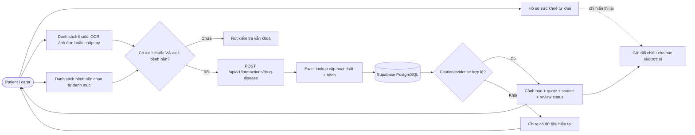
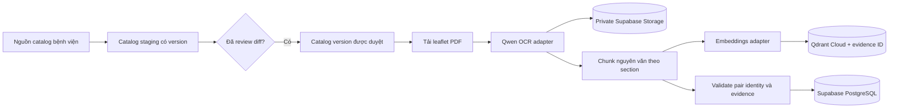
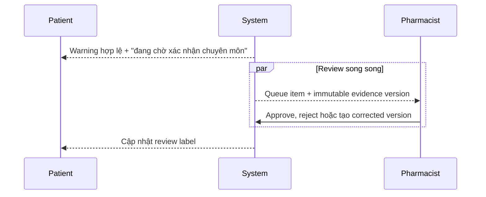

# Luồng toàn ứng dụng

Đây là flow xuyên tính năng. Priority, owner và status vẫn nằm trong Jira `VMEC`.

## Luồng bệnh nhân

OCR output không tự trở thành định danh thuốc. Người dùng phải xác nhận catalog result.
LLM không sinh SQL, không quyết định drug-drug existence hoặc severity; database access chỉ
qua repository.

## Luồng thuốc – bệnh nền

Bám theo [`demo-ui/interactions-disease.html`](../demo-ui/interactions-disease.html) đã
được duyệt ngày 08/08/2026. Chi tiết ở
[`specs/002-drug-disease-check/spec.md`](002-drug-disease-check/spec.md).

Hai điểm dễ làm sai:

- **Hồ sơ không chảy vào lookup.** Tình trạng đặc biệt khai trong hồ sơ (mang thai, suy
  thận…) chỉ được hiển thị lại và gửi kèm cho chuyên môn. Hệ thống không tự đưa chúng vào
  danh sách bệnh nền của lượt tra cứu — làm vậy là suy luận thay người dùng.
- **Exact lookup, không similarity.** Cùng lý do như thuốc–thuốc ở ADR 0004: một bản ghi
  của bệnh gần nghĩa có nguồn thật và trích dẫn thật nhưng sai cặp.

## Luồng ingestion tờ hướng dẫn

Crawl, download, OCR, chunking và indexing là batch operation, không chạy trong patient
request. Refresh tạo version mới; không overwrite evidence production âm thầm.

## Luồng duyệt chuyên môn

Pending không phải điều kiện chặn hiển thị; rejected evidence không được trả cho patient.

## Ranh giới delivery

- Feature 001: catalog confirmation + cited drug-drug/drug-food check.
- Feature 002: hồ sơ sức khoẻ tự khai + cited drug-disease check (ADR 0017).
- Đối chiếu liều dùng: trong phạm vi theo [ADR 0018](../adrs/0018-dose-comparison-boundary.md)
  (chấp nhận 09/08/2026); chặn kỹ thuật còn lại là ingestion chưa trích ngưỡng liều dạng có
  cấu trúc từ mục *Liều và cách dùng*.
- Prescription OCR: cần spec, privacy rule, contract và validation riêng.
- Pharmacist mutation: cần authorization/evidence-version spec riêng.
- Production VPS: chờ ADR topology triển khai được leader duyệt.

## Nguồn tham chiếu giao diện

[`demo-ui/`](../demo-ui/) là bản demo HTML/CSS đã được duyệt ngày 08/08/2026 và là **nguồn
tham chiếu bố cục màn hình** cho tới khi có wireframe Figma đầy đủ. Các màn quan trọng:
`interactions-drug.html`, `interactions-food.html`, `interactions-disease.html`,
`drug-info.html`, `drug-detail.html`, `doctor.html`.

Demo dùng dữ liệu minh hoạ trong `demo-ui/js/data.js`. Dữ liệu đó **không** phải nguồn sự
thật và một phần tự ghi nhãn "chưa có nguồn trích dẫn cụ thể" — không được bê lên
production, xem mục *Câu hỏi còn mở* trong spec 002.
