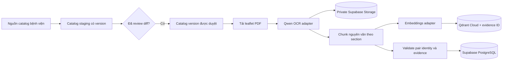
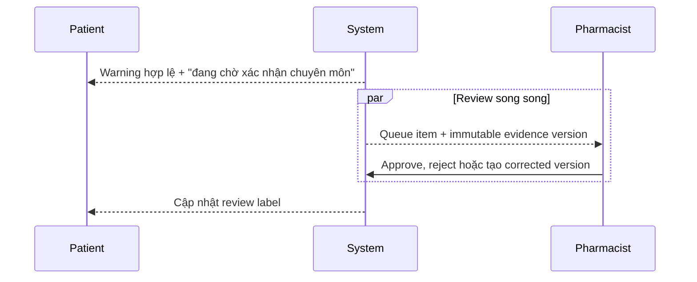

# Luồng toàn ứng dụng

Đây là flow xuyên tính năng. Priority, owner và status vẫn nằm trong Jira `VMEC`.

## Luồng bệnh nhân

```mermaid
flowchart LR
    Patient([Patient / carer]) --> Input{Nhập thuốc}
    Input -->|Tìm bằng text| Search[Tìm catalog]
    Input -->|Ảnh hoặc PDF đơn thuốc| Upload[Upload private đã validate]
    Upload --> Gemini[Gemini OCR adapter]
    Gemini --> Candidate[Candidate chưa được tin cậy]
    Candidate --> Search
    Search --> Confirm[Người dùng xác nhận stable catalog ID]
    Confirm --> Check[POST /api/v1/interactions/check]
    Check --> Flow[LangGraph workflow xác định trước]
    Flow -->|drug-drug| Exact[Exact-pair repository]
    Flow -->|drug-food| Retrieve[Scoped Qdrant retrieval]
    Exact --> PG[(Supabase PostgreSQL)]
    Retrieve --> Q[(Qdrant Cloud)]
    Q --> Resolve[Resolve evidence ID]
    Resolve --> PG
    PG --> Valid{Citation/evidence hợp lệ?}
    Valid -->|Có| Result[Warning + quote + source + review status]
    Valid -->|Không| Missing[Chưa có dữ liệu hiện tại]
    Result --> Patient
    Missing --> Patient
```

OCR output không tự trở thành định danh thuốc. Người dùng phải xác nhận catalog result.
LLM không sinh SQL, không quyết định drug-drug existence hoặc severity; database access chỉ
qua repository.

## Luồng ingestion tờ hướng dẫn

Crawl, download, OCR, chunking và indexing là batch operation, không chạy trong patient
request. Refresh tạo version mới; không overwrite evidence production âm thầm.

## Luồng duyệt chuyên môn

Pending không phải điều kiện chặn hiển thị; rejected evidence không được trả cho patient.

## Ranh giới delivery

- Feature 001: catalog confirmation + cited drug-drug/drug-food check.
- Prescription OCR: cần spec, privacy rule, contract và validation riêng.
- Pharmacist mutation: cần authorization/evidence-version spec riêng.
- Production VPS: chờ ADR topology triển khai được leader duyệt.
